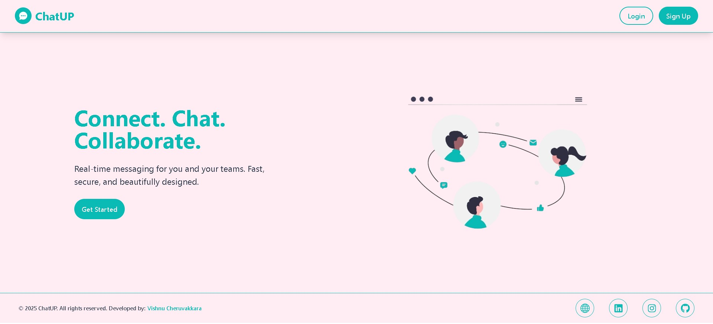

# ChatUp
ChatUp is a full-stack chat communication application developed as part of a machine test. It uses Django for the backend, React for the frontend, and WebSockets for real-time communication.

<p align="center">
  
</p>

<p align="center">
  <a href="https://chat-up-brown.vercel.app/" target="_blank">
    
  </a>
  &nbsp;
  <a href="https://www.youtube.com/watch?v=YOUR_VIDEO_ID" target="_blank">
    
  </a>
  &nbsp;
  <a href="https://www.linkedin.com/" target="_blank">
    
  </a>
</p>


## Table of Contents
- Features
- Technologies Used
- Installation and Setup
- Testing
- Contributing
- License

---

## Features
- Secure authentication
- Real-time chat messaging    
- Chat room creation and management  
- Responsive design
  
## Technologies Used

- **Backend (Django)**
  - Django, Django REST Framework, Django Channels  
  - JWT authentication  
  - WebSocket support  
  - APIs for room management

- **Frontend (React)**
  - React, Axios  
  - Registration & login forms  
  - Chat interface  

- **Others**
  - Redis for WebSockets  

- **Integration**
  - JWT authentication connected between frontend and backend (access and refresh token both handled in cookie as http only)
  - WebSocket real-time updates
    
## Installation and Setup
1. Clone the repository
   
  ```
  git clone https://github.com/VishnuCheruvakkara/ChatUp.git

  cd ChatUp
  ```
   
### Backend (Django) Setup

1. Create and activate a virtual environment
   
  ```
  cd backend
  ```
2. Create and activate a virtual environment
   
  ```
  python -m venv env
  ```
  > activate env on Windows
  ```
  env\Scripts\activate
  ```

  > activate env macOS/Linux
  
  ```
  source env/bin/activate
  ```

3. Install dependencies
   ```
   pip install -r requirements.txt
   ```

4. Install Redis (required for WebSocket communication)
   - Windows:
     
     On Windows, you can use Memurai (a lightweight Redis alternative), Redis for Windows from the      GitHub archive (older but works), or WSL (Windows Subsystem for Linux) to run the native           Linux version inside Windows.
    
     
   - macOS:
     ```
     brew install redis
     brew services start redis
     ```
   - Linux (Ubuntu/Debian):
     ```
     sudo apt update
     sudo apt install redis-server
     sudo systemctl enable redis-server
     sudo systemctl start redis-server
     ```
     
   Verify installation by running:
   ```
   redis-cli ping
   ```
   Note : After running the above command you will get a reponse as : PONG

5. Apply database migrations
   
   ```
   python manage.py migrate
   ```
   
6. Create a superuser (for admin access)
   ```
   python manage.py createsuperuser
   ```

7. Run the development server
     You can use either Daphne or Uvicorn:

      - Run with Daphne:
          ```
          daphne project_chatup.asgi:application
          ```
      - Run with Uvicorn:
          ```
          uvicorn project_chatup.asgi:application --reload
          ```

    Backend will now be running at: http://127.0.0.1:8000/

   
### Frontend (React) Setup

  1. Navigate to the frontend folder:
     
      ```
      cd frontend
      ```
  2. Install dependencies:
      ```
      npm install
      ```
  3. Start the Vite development server:
      ```
      npm run dev
      ```

  The frontend will now be running at: http://localhost:5173/ (default Vite port).
   
## Testing
- Backend unit tests: `python manage.py test`  
- Frontend tests: `npm test`  

## Contributing
- Fork the repository  
- Create a new branch  
- Commit changes  
- Open a pull request  

## License
This project is for machine test purposes.
